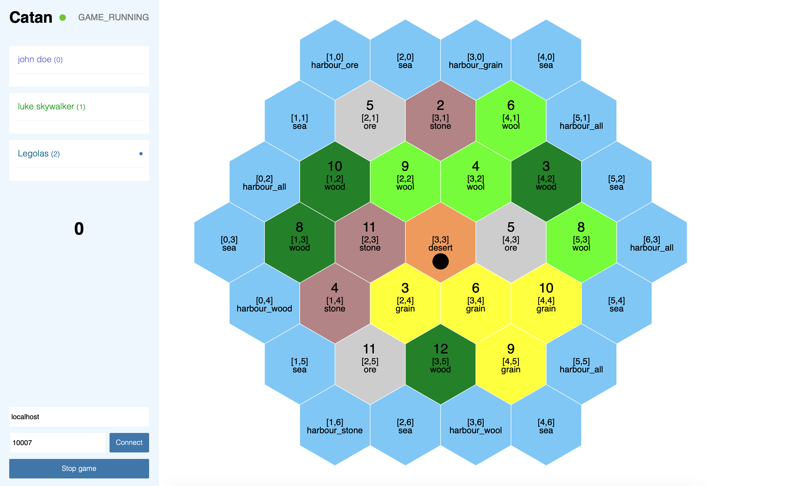
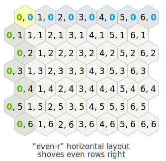

[](https://travis-ci.com/mrlukasbos/Catan)
[](https://codecov.io/gh/mrlukasbos/Catan)

# Catan challenge

The goal of this challenge is to build a digital version of the catan boardgame, make a visualization for it, and then compete against each other by building a player ai.




## Getting started

- clone this repository
- run mvn install
- run the application

- you can view the interface by opening index.html in your browser and connecting to localhost:10007
- you can connect as a player using a TCP socket on port 10006. You can write your own program, or use telnet

## Definitions
| Type | Description                                                                                       |
|------|---------------------------------------------------------------------------------------------------|
| Tile | A tile represents a physical tile of which the board is compromised.                              |
| Edge | Represents the edge between two tiles. Roads can be placed on edges.                              |
| Node | Represents the point where three tiles come together. Villages and cities can be placed on nodes. |

## Coordinate system
Every tile is given a offset coordinate using the 'even-r' horizontal layout. Columns are named col (q). Rows are named row (r).



A edge can be found using the coordinates of the two adjacent tiles. For example `([0,0],[1,0])` depicts the edge between tile `[0,0]` and `[1,0]`. Nodes can be located using the coordinates of the three ajacent tiles. Therefore `([0,0], [1,0], [1,1])` gives us the node between tiles `[0,0]`, `[1,0]` and `[1,1]`.


## Starting a game
The game can be started by connecting with the game through the interface. 


## Communicating as a player

For the build phase a command is a JSON array which consists of all the buildings that the player wants to build during his turn

> Note: For the initial building phase this array should contain a street and a village only.

> Note: when sending multiple build commands the order is not important, the server is able to find a legal combination, if any.

### Rules

During the build phase there is a specific set of rules on what can be built and what not.

- A structure always needs to be build next to an already existing structure
- villages / cities always need to be at least two edges apart from other villages/cities
- Structures can only be build on land
- structures cannot be built on top of each other
- Roads are allowed to cross
- To build you need to have enough resources to do so
- Cities can only be built by replacing a village

### Legal build commands

Trading:
```
 [{ "from": "ore", "to": "wood" }]
  [{ "from": "ore", "to": "grain" }]
 [{ "from": "grain", "to": "stone" }]
  [{ "from": "grain", "to": "wood" }]
 [{ "from": "whool", "to": "grain" }]
  [{ "from": "whool", "to": "wood" }]

  [{ "from": "wood", "to": "stone" }]
  [{ "from": "wood", "to": "whool" }]

 [{ "from": "ore", "to": "ore" }] // could be useful when wanting to avoid bandit

 [{ "from": "stone", "to": "wood" }, { "from": "grain", "to": "stone" }]
 [{ "from": "stone", "to": "wood" }, { "from": "stone", "to": "ore" }]
 
  [{ "from": "grain", "to": "wood" }, { "from": "grain", "to": "ore" }]
  [{ "from": "whool", "to": "wood" }, { "from": "whool", "to": "ore" }]
  [{ "from": "ore", "to": "wood" }, { "from": "ore", "to": "grain" }]
  [{ "from": "stone", "to": "wood" }, { "from": "stone", "to": "grain" }]

  [{ "from": "whool", "to": "wood" }, { "from": "wood", "to": "stone" }]


```


A street and a village:
```
 [{ "structure": "street", "location": "([3,4],[4,3])" }, { "structure": "village", "location": "([3,3],[3,4],[4,3])" }]
 [{ "structure": "street", "location": "([1,4],[2,4])" }, { "structure": "village", "location": "([1,4],[2,4],[2,5])" }]
 [{ "structure": "street", "location": "([2,3],[2,4])" }, { "structure": "village", "location": "([2,3],[2,4],[3,3])" }]
 [{ "structure": "village", "location": "([1,2],[1,3],[2,3])" }, { "structure": "street", "location": "([1,2],[1,3])" }]
 [{ "structure": "village", "location": "([1,2],[2,1],[2,2])" }, { "structure": "street", "location": "([1,2],[2,2])" }]

```

Interfering villages:
```
 [{ "structure": "street", "location": "([3,1],[3,2])" }, { "structure": "village", "location": "([2,2],[3,1],[3,2])" }]
 [{ "structure": "street", "location": "([2,2],[3,1])" }, { "structure": "village", "location": "([2,1],[2,2],[3,1])" }]
```


Building nothing:
```
 []
```

A single village, city or street
```

 [{ "structure": "village", "location": "([1,2],[2,1],[2,2])" }]
 [{ "structure": "village", "location": "([4,3],[4,4],[5,3])" }]

 [{ "structure": "city", "location": "([1,2],[2,1],[2,2])" }]
 [{ "structure": "city", "location": "([3,3],[3,4],[4,3])" }]

 [{ "structure": "street", "location": "([2,2],[3,1])" }]
 [{ "structure": "street", "location": "([1,4],[2,3])" }]
 [{ "structure": "street", "location": "([4,3],[4,4])" }]
 [{ "structure": "street", "location": "([3,3],[4,3])" }]

 [{ "structure": "street", "location": "([2,4],[2,5])" }]

 [{ "structure": "development_card" }]
```


It is perfectly legal to build multiple things after each other in one command. 
For example: building this city alone might not be legal:
```
[{ "structure": "city", "location": "([1,2],[2,1],[2,2])" }]
```
But if there is already a village it would be fine. 
If you want to build a city from nothing, you first have to build a village and then build a city. This can be done in one command, and the order does not matter.
```
[{ "structure": "city", "location": "([1,2],[2,1],[2,2])" }, { "structure": "village", "location": "([1,2],[2,1],[2,2])" }]
```

Other examples
```
 (a city and a street)
 [{ "structure": "city", "location": "([1,2],[2,1],[2,2])" }, { "structure": "street", "location": "([2,2],[3,1])" }]

 (a village and street that are not connected)
 [{ "structure": "village", "location": "([1,2],[2,1],[2,2])" }, { "structure": "street", "location": "([2,2],[3,1])" }]

 (two streets)
 [{ "structure": "street", "location": "([3,1],[3,2])" }, { "structure": "street", "location": "([2,2],[3,2])" }]
*/
